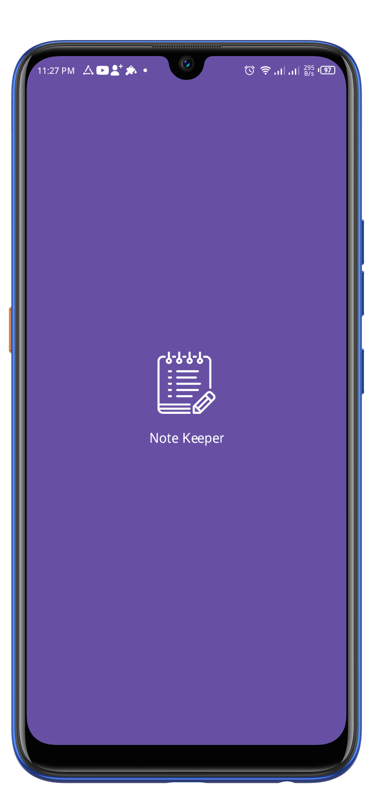
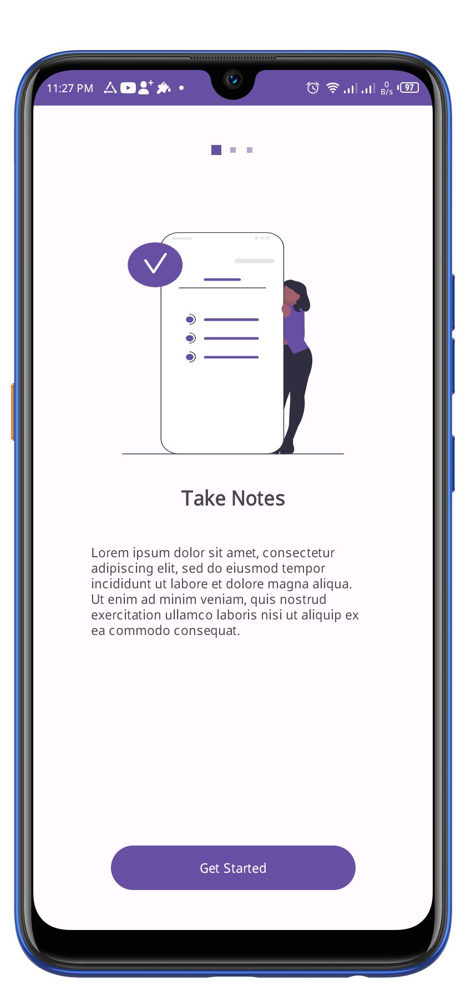
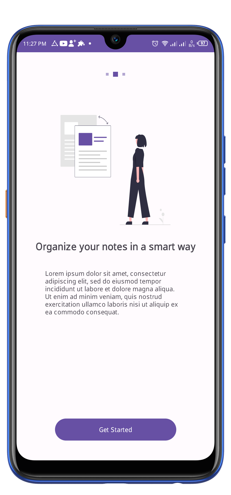
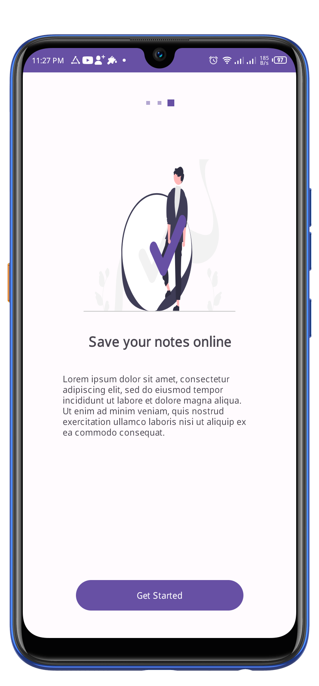
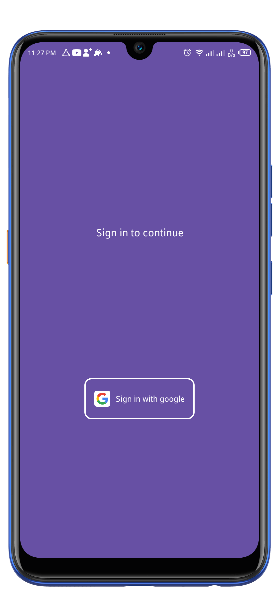
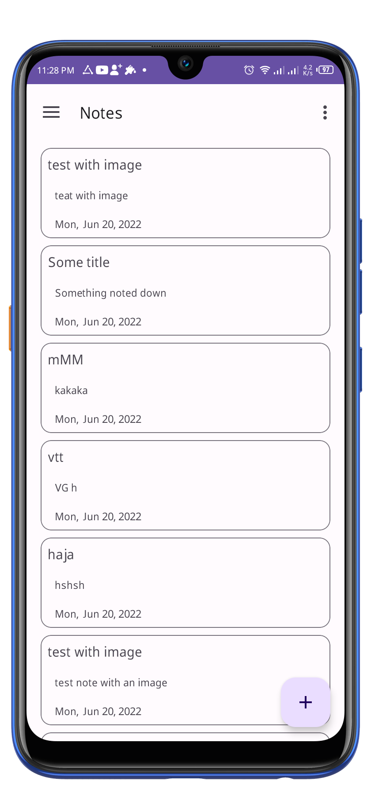
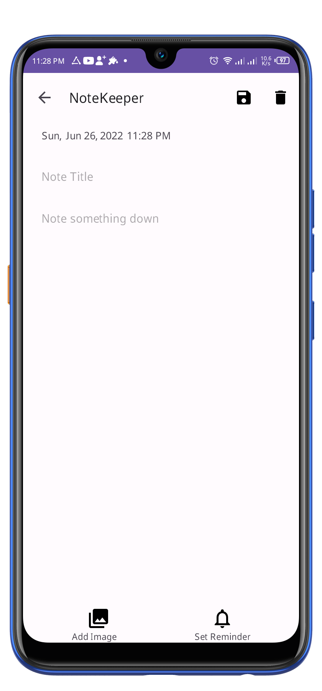
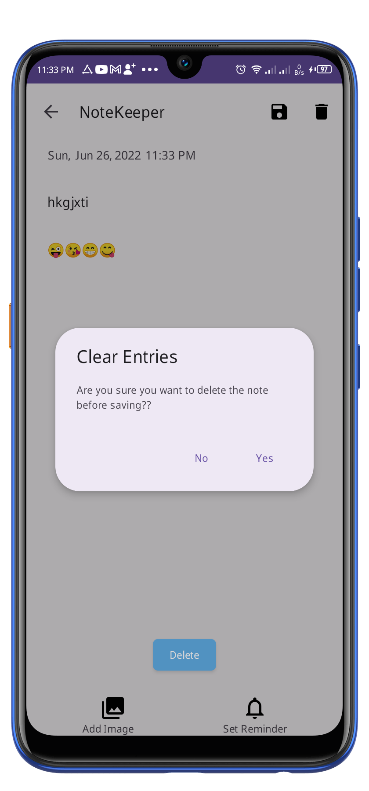
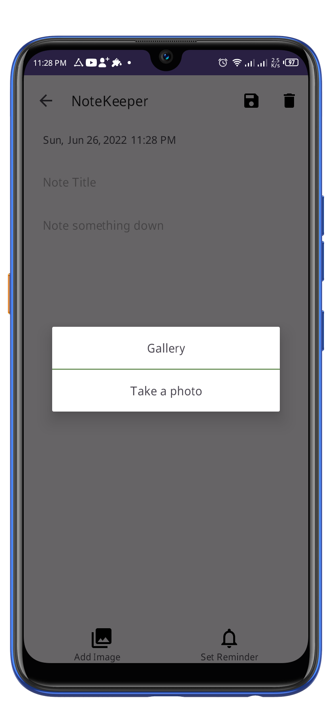
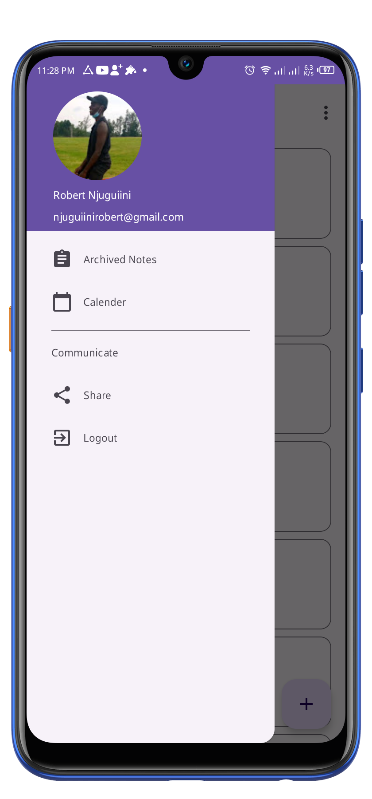

# NoteKeeper
NoteKeeper is an android application used to create and save notes online. The notes saved are to be accessible from any device when you login to your account. The notes are saved online on Firebase Firestore. 
.It is built upon the new Maaterial 3 UI components with the MVVM pattern and the latest Jetpack components. 

*NB*
> This project is still under development and not all features are fully functional.

# Technologies
- [Firebase Firestore](https://firebase.google.com/docs/firestore) - Cloud Firestore is a flexible, scalable database for mobile, web, and server development from Firebase and Google Cloud. 
- [Kotlin](https://developer.android.com/kotlin) - Kotlin is a programming language that can run on JVM. Google has announced Kotlin as one of its officially supported programming languages in Android Studio; and the Android community is migrating at a pace from Java to Kotlin
- [Navigation Components](https://developer.android.com/guide/navigation/navigation-getting-started) -  Helps you implement navigation, from simple button clicks to more complex patterns, such as app bars and the navigation drawer.
- [Viewmodel](https://developer.android.com/topic/libraries/architecture/viewmodel) -The ViewModel class is designed to store and manage UI-related data in a lifecycle conscious way
- [LiveData](https://developer.android.com/topic/libraries/architecture/livedata) -  A lifecycle-aware data holder with the observer pattern
- [Kotlin Coroutines](https://developer.android.com/kotlin/coroutines) - A concurrency design pattern that you can use on Android to simplify code that executes asynchronously
- [Hilt-Dagger](https://developer.android.com/training/dependency-injection/hilt-android) - Hilt is a dependency injection library for Android that reduces the boilerplate of doing manual dependency injection in your project. Doing manual dependency injection requires you to construct every class and its dependencies by hand, and to use containers to reuse and manage dependencies.
- [MVVM](https://www.geeksforgeeks.org/mvvm-model-view-viewmodel-architecture-pattern-in-android/) - MVVM stands for Model, View, ViewModel. Model: This holds the data of the application. It cannot directly talk to the View. Generally, it's recommended to expose the data to the ViewModel through Observables.
- [SharedPreferences](https://developer.android.com/training/data-storage/shared-preferences) - An object points to a file containing key-value pairs and provides simple methods to read and write them. This is used to store some states of the application like Onboarding status and status of logged in users.

# Screenshots
 
 ## Splash screen
 
 

  

  
 ## Onboarding Screens
 
 

  

  
 ## Sign in screen
 
 

  

  
 ## NoteKeeper 
 
 

  

  
## Other Features COMING SOON...!
